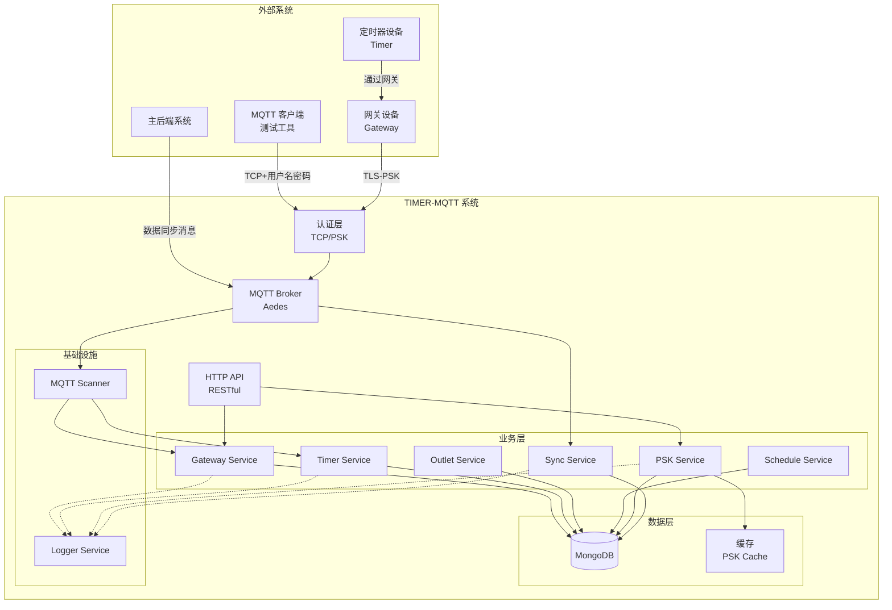
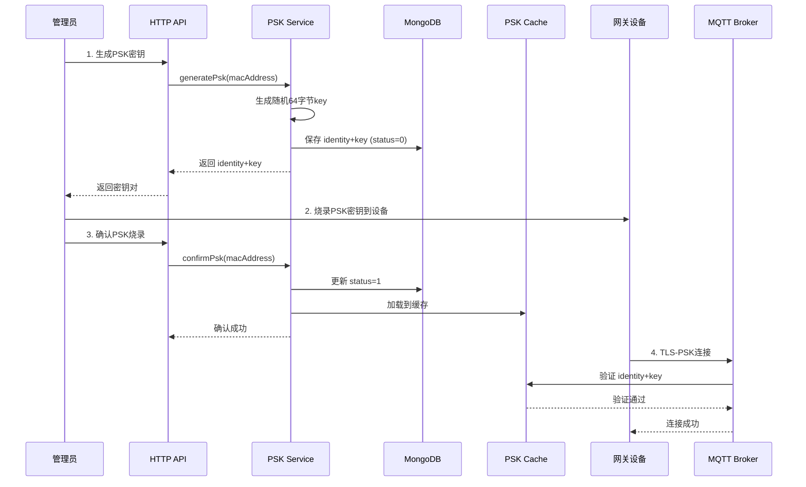
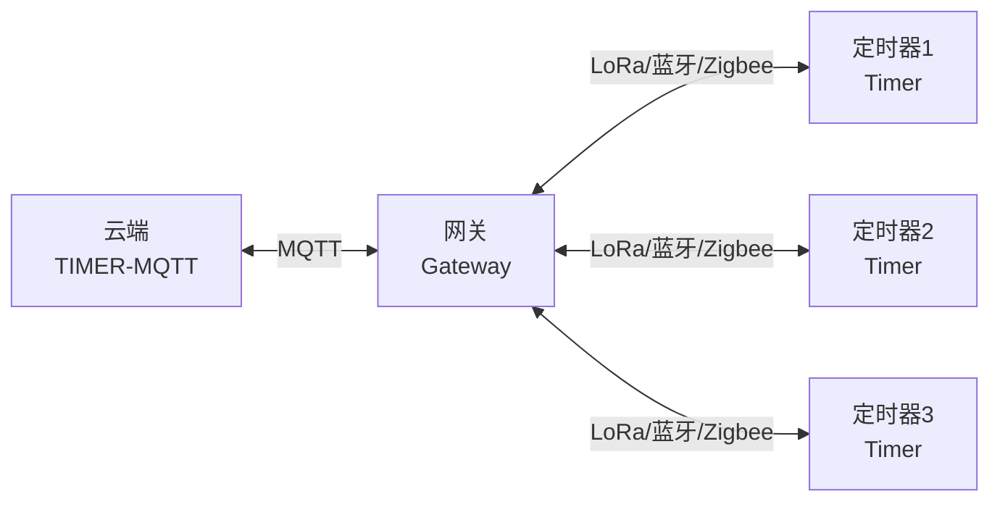
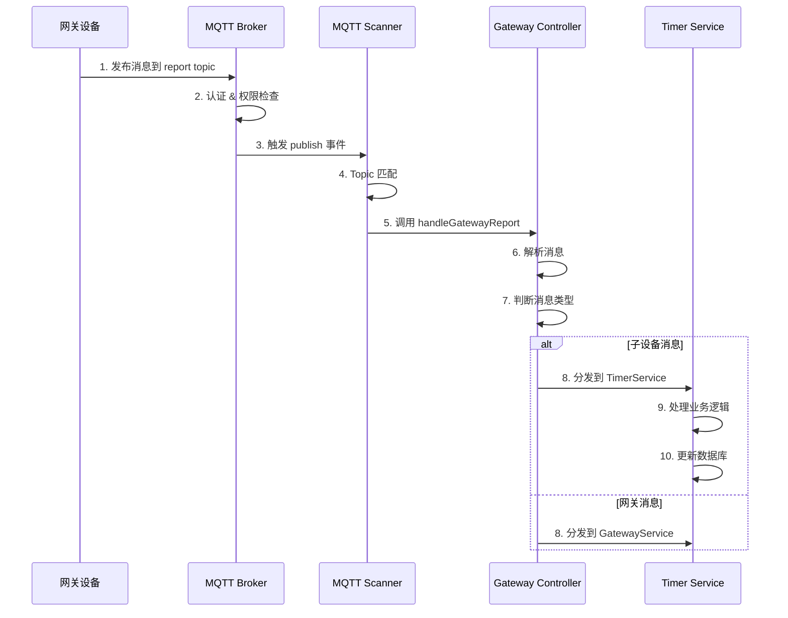
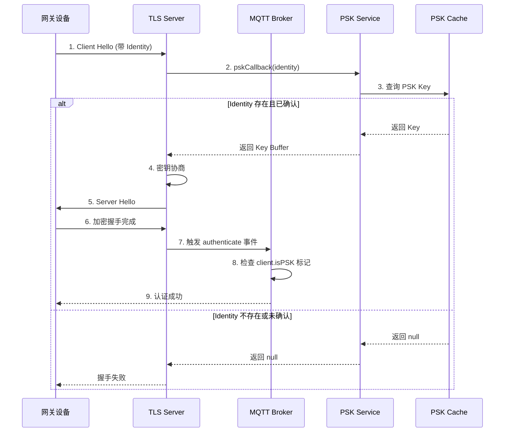
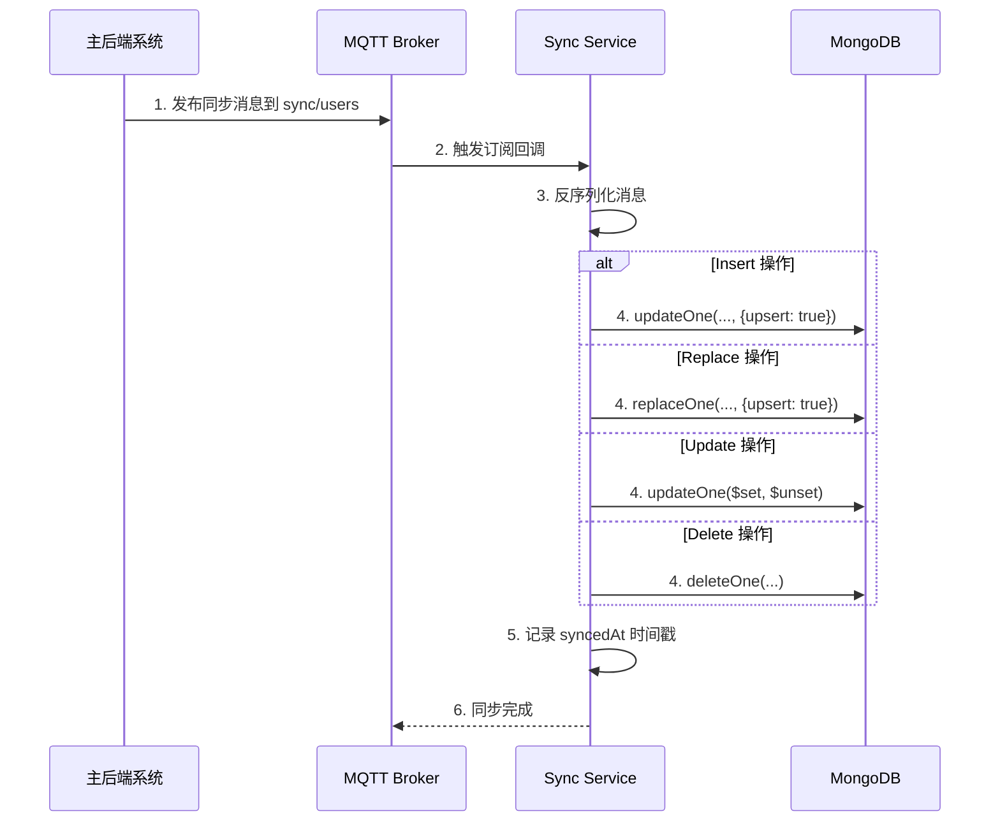
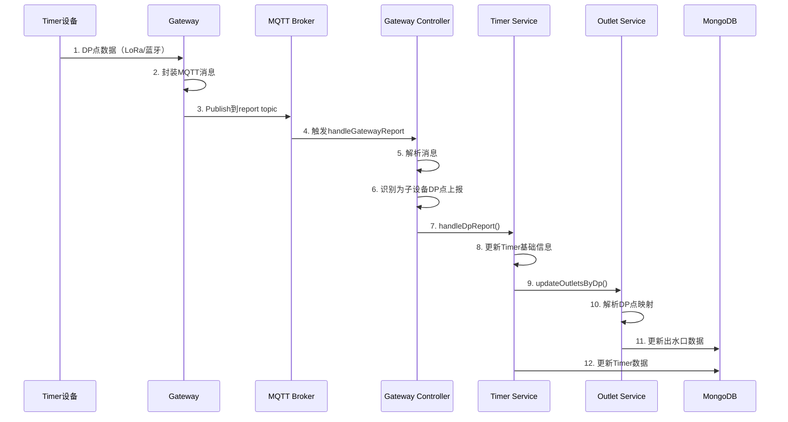
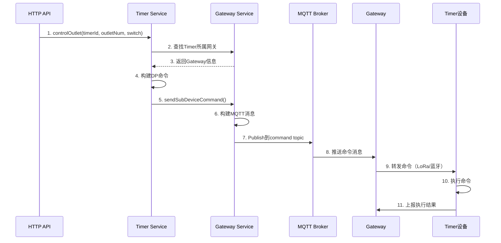
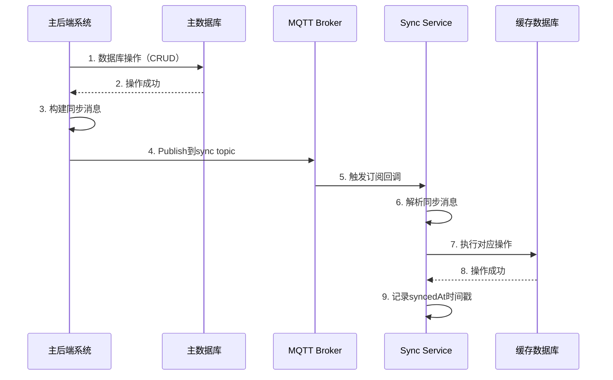
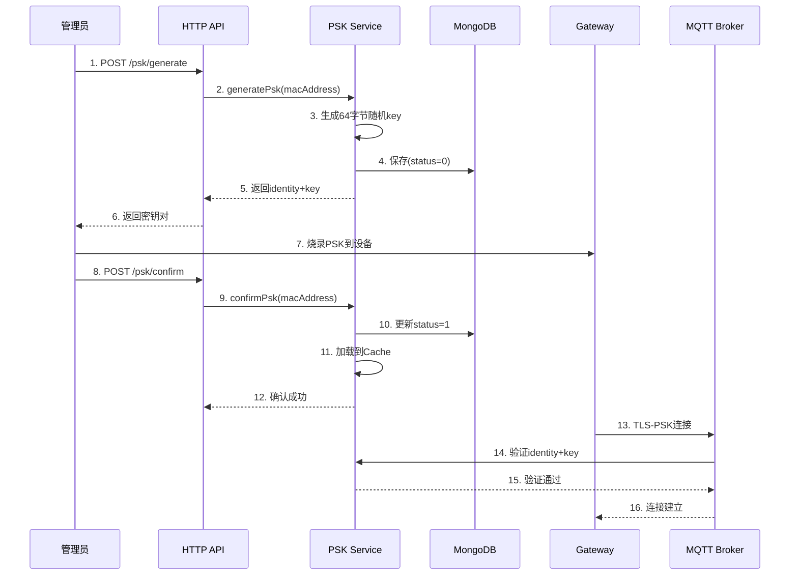

# TIMER-MQTT 项目架构设计文档

## 目录
- [1. 项目概述](#1-项目概述)
- [2. 技术栈](#2-技术栈)
- [3. 系统架构](#3-系统架构)
- [4. 核心模块设计](#4-核心模块设计)
- [5. MQTT 通信机制](#5-mqtt-通信机制)
- [6. PSK 认证机制](#6-psk-认证机制)
- [7. 事件驱动数据同步](#7-事件驱动数据同步)
- [8. 数据流设计](#8-数据流设计)
- [9. 安全设计](#9-安全设计)

---

## 1. 项目概述

### 1.1 项目类型
**TIMER-MQTT** 是一个基于 NestJS 框架的 **IoT 设备管理与数据同步系统**，主要用于管理智能灌溉定时器（Timer）设备及其网关（Gateway）。

**项目特点：**
- IoT 设备管理系统
- 事件驱动架构
- MQTT 协议通信
- 实时数据同步
- 网关-子设备架构
- RESTful API 服务

### 1.2 核心功能
1. **设备管理**：管理网关和子设备（Timer）的生命周期
2. **MQTT 通信**：基于 Aedes 的 MQTT Broker，支持 TCP 和 TLS-PSK 双模式
3. **PSK 认证**：Pre-Shared Key 认证机制，保证设备通信安全
4. **数据同步**：基于 MQTT 的事件驱动数据同步机制
5. **设备控制**：远程控制定时器出水口、调度任务等
6. **日志管理**：统一的日志系统，分类记录不同模块的操作日志

### 1.3 应用场景
- 智能农业灌溉系统
- IoT 设备远程管理
- 多网关-子设备架构的分布式系统
- 实时数据采集与监控

---

## 2. 技术栈

### 2.1 后端框架
| 技术 | 版本 | 用途 |
|------|------|------|
| **NestJS** | ^11.0.1 | 企业级 Node.js 应用框架 |
| **TypeScript** | ^5.7.3 | 类型安全的开发语言 |
| **Node.js** | - | 运行时环境 |

### 2.2 数据库
| 技术 | 版本 | 用途 |
|------|------|------|
| **MongoDB** | - | 主数据库，存储设备、用户、配置等数据 |
| **Mongoose** | 7.1.1 | MongoDB ODM |

### 2.3 通信协议
| 技术 | 版本 | 用途 |
|------|------|------|
| **MQTT** | ^5.14.1 | 设备通信协议客户端 |
| **Aedes** | ^0.51.3 | 轻量级 MQTT Broker |
| **mqtt-packet** | ^9.0.2 | MQTT 消息解析 |

### 2.4 安全认证
| 技术 | 版本 | 用途 |
|------|------|------|
| **bcrypt** | ^6.0.0 | 密码加密 |
| **TLS-PSK** | - | Pre-Shared Key 认证 |
| **crypto** | (内置) | PSK 密钥生成 |

### 2.5 日志系统
| 技术 | 版本 | 用途 |
|------|------|------|
| **winston** | ^3.18.3 | 日志框架 |
| **winston-daily-rotate-file** | ^5.0.0 | 日志文件轮转 |
| **moment** | ^2.30.1 | 时间格式化 |

### 2.6 API 文档
| 技术 | 版本 | 用途 |
|------|------|------|
| **@nestjs/swagger** | ^11.2.3 | OpenAPI 文档生成 |
| **nest-knife4j** | ^1.0.1 | Swagger UI 增强 |

### 2.7 数据验证
| 技术 | 版本 | 用途 |
|------|------|------|
| **class-validator** | ^0.14.2 | 数据验证 |
| **class-transformer** | ^0.5.1 | 数据转换 |

---

## 3. 系统架构

### 3.1 整体架构图



### 3.2 系统分层

#### 3.2.1 接入层
- **HTTP API**：提供 RESTful 接口，供外部系统调用
- **MQTT Broker**：基于 Aedes 的消息代理，处理设备通信

#### 3.2.2 认证层
- **TCP 认证**：用户名密码认证（用于测试工具）
- **PSK 认证**：TLS-PSK 认证（用于网关设备）

#### 3.2.3 业务层
- **Gateway Module**：网关管理
- **Timer Module**：定时器设备管理
- **Outlet Module**：出水口管理
- **Schedule Module**：调度任务管理
- **PSK Module**：PSK 密钥管理
- **Sync Module**：数据同步管理

#### 3.2.4 数据层
- **MongoDB**：持久化存储
- **内存缓存**：PSK 密钥缓存

#### 3.2.5 基础设施层
- **Logger Service**：统一日志管理
- **MQTT Scanner**：MQTT 消息处理器扫描注册

### 3.3 目录结构

```
TIMER-MQTT/
├── src/
│   ├── app.module.ts              # 应用主模块
│   ├── main.ts                     # 应用入口
│   │
│   ├── common/                     # 公共模块
│   │   ├── decorators/            # 装饰器（MQTT、API等）
│   │   ├── filters/               # 异常过滤器
│   │   ├── interceptors/          # 拦截器
│   │   ├── logger/                # 日志模块
│   │   └── utils/                 # 工具函数
│   │
│   ├── config/                     # 配置文件
│   │   ├── database.config.ts     # 数据库配置
│   │   ├── mqtt.config.ts         # MQTT 配置
│   │   └── sync-tables.config.ts  # 同步表配置
│   │
│   ├── core/                       # 核心模块
│   │   └── mqtt/                  # MQTT 核心
│   │       ├── mqtt-broker.service.ts    # MQTT Broker
│   │       └── mqtt-scanner.service.ts   # 消息处理器扫描
│   │
│   ├── modules/                    # 业务模块
│   │   ├── gateway/               # 网关模块
│   │   ├── timer/                 # 定时器模块
│   │   ├── outlet/                # 出水口模块
│   │   ├── schedule/              # 调度模块
│   │   ├── psk/                   # PSK 认证模块
│   │   └── sync/                  # 数据同步模块
│   │
│   └── shared/                     # 共享资源
│       └── constants/             # 常量定义
│           ├── mqtt-topic.constants.ts    # MQTT Topic
│           └── log-messages.constants.ts  # 日志消息
│
├── docs/                           # 文档目录
├── logs/                           # 日志文件目录
└── package.json                    # 项目依赖
```

---

## 4. 核心模块设计

### 4.1 Gateway Module（网关模块）

#### 职责
1. 管理网关设备的生命周期（注册、注销、更新等）
2. 作为 MQTT 消息的统一入口
3. 根据消息类型分发到对应的 Service
4. 提供网关到子设备的命令转发

#### 核心类
- **GatewayController**：唯一的 MQTT 消息入口
- **GatewayService**：网关业务逻辑处理

#### 关键方法
```typescript
// 处理所有网关上报的消息
@MqttSubscribe(HanqiMqttTopic.allGatewayReport())
async handleGatewayReport(@MqttPayload() payload: Buffer)

// 向网关发送命令
async sendGatewayCommand(gatewayId: string, msgType: string, data: any)

// 通过网关向子设备发送命令
async sendSubDeviceCommand(gatewayId: string, subDeviceId: string, msgType: string, data: any)
```

#### 数据模型（HanqiGateway Schema）
```typescript
{
  gatewayId: string         // 网关ID（MAC地址）
  mac_address: string       // MAC地址
  is_connected: number      // 连接状态：0离线，1在线
  wifi_rssi: number         // WiFi信号强度
  firmware_version: string  // 固件版本
  last_seen: Date          // 最后在线时间
  userId: ObjectId         // 所属用户ID
}
```

### 4.2 Timer Module（定时器模块）

#### 职责
1. 处理 Timer 设备的 DP 点数据上报
2. 更新设备状态和出水口数据
3. 提供设备控制方法（开关、设置时长等）
4. 处理设备心跳和事件上报

#### 核心类
- **TimerService**：Timer 设备业务逻辑

#### 关键方法
```typescript
// 处理DP点上报
async handleDpReport(message: MqttUnifiedMessage<DpReportData>)

// 控制出水口
async controlOutlet(timerId: string, outletNumber: number, switchOn: boolean, duration?: number)
```

#### 数据模型（HanqiTimer Schema）
```typescript
{
  timerId: string           // 设备ID
  gatewayId: ObjectId      // 所属网关ID
  status: number           // 设备状态：0离线，1在线
  battery_level: number    // 电池电量
  signal_strength: number  // 信号强度
  firmware_version: string // 固件版本
  outlet_count: number     // 出水口数量
  dp_data: Object          // DP点原始数据
  last_seen: Date         // 最后在线时间
}
```

### 4.3 Outlet Module（出水口模块）

#### 职责
1. 管理定时器的出水口状态
2. 解析和更新 DP 点数据
3. 提供出水口的开关、时长等控制

#### DP 点映射规则
```
出水口1：DP 21-40
出水口2：DP 41-60
出水口3：DP 61-80
出水口4：DP 81-100

每个出水口占用20个DP点：
- DP+0：开关状态
- DP+1：运行模式
- DP+2：手动运行时长
- DP+3：当前状态
- ...
```

#### 数据模型（Outlet Schema）
```typescript
{
  timerId: ObjectId        // 所属Timer设备ID
  outletNumber: number     // 出水口编号（1-4）
  switchStatus: boolean    // 开关状态
  runMode: number          // 运行模式
  manualDuration: number   // 手动运行时长
  currentStatus: number    // 当前运行状态
}
```

### 4.4 PSK Module（PSK 认证模块）

#### 职责
1. 生成网关的 PSK 密钥对（identity + key）
2. 管理 PSK 的烧录确认流程
3. 提供 PSK 验证接口（供 MQTT Broker 调用）
4. 维护 PSK 内存缓存，加速认证

#### 核心流程


#### 数据模型（HanqiPsk Schema）
```typescript
{
  mac_address: string   // 网关MAC地址（唯一索引）
  identity: string      // PSK Identity（通常等于MAC）
  key: string          // PSK Key（128位十六进制）
  status: number       // 0:待确认，1:已确认
}
```

### 4.5 Sync Module（数据同步模块）

#### 职责
1. 订阅主后端系统的数据同步消息
2. 接收并处理 CRUD 操作消息
3. 更新本地缓存数据库
4. 支持增量同步和全量同步

#### 核心方法
```typescript
// 订阅指定表的同步消息
private subscribeTable(config: SyncTableConfig)

// 处理同步消息
private async handleSync(config: SyncTableConfig, payload: any)
```

#### 支持的操作类型
- **insert**：插入或更新（upsert）
- **replace**：替换整个文档
- **update**：部分字段更新（支持删除字段）
- **delete**：删除文档

---

## 5. MQTT 通信机制

### 5.1 MQTT 架构设计

#### 网关-子设备架构
本系统采用 **网关-子设备** 架构：
- 云端（TIMER-MQTT）只和网关通信
- 所有子设备消息通过网关转发
- 通过 `msgType` 和 `subDeviceId` 字段区分设备和消息类型



### 5.2 Topic 设计

#### 核心 Topic 规范
```typescript
// 网关数据上报（网关 -> 云端）
hanqi/gateway/{gatewayId}/report

// 网关命令下发（云端 -> 网关）
hanqi/gateway/{gatewayId}/command

// 网关响应（网关 -> 云端，可选）
hanqi/gateway/{gatewayId}/response

// 订阅所有网关上报（云端订阅）
hanqi/gateway/+/report
```

#### 示例
```
// 网关 gw_123456 上报消息
hanqi/gateway/gw_123456/report

// 云端向网关 gw_123456 发送命令
hanqi/gateway/gw_123456/command
```

### 5.3 消息格式

#### 统一消息结构
```typescript
interface MqttUnifiedMessage<T = any> {
  msgType: string        // 消息类型
  msgId?: string         // 消息ID（可选）
  deviceId: string       // 网关ID
  subDeviceId?: string   // 子设备ID（可选）
  timestamp: number      // 时间戳（秒）
  data: T               // 消息数据
}
```

#### 消息类型（msgType）
```typescript
enum MqttMessageType {
  // 网关消息
  DEVICE_STATUS = 'device_status',      // 设备状态
  OPERATE_DEVICE = 'operate_devices',   // 设备操作

  // 子设备消息
  DP_REPORT = 'dp_report',              // DP点数据上报
  DP_COMMAND = 'dp_command',            // DP点命令下发
  EVENT_REPORT = 'event_report',        // 事件上报
  HEARTBEAT = 'heartbeat',              // 心跳
}
```

#### 消息示例

**网关状态上报**
```json
{
  "msgType": "device_status",
  "deviceId": "gw_123456",
  "timestamp": 1701234567,
  "data": {
    "online": true,
    "wifi_rssi": -45,
    "firmware": "v1.2.3",
    "memory_usage": 45.2,
    "cpu_usage": 12.5
  }
}
```

**子设备 DP 点上报**
```json
{
  "msgType": "dp_report",
  "deviceId": "gw_123456",
  "subDeviceId": "timer_789",
  "timestamp": 1701234567,
  "data": {
    "dps": {
      "1": true,        // 设备开关
      "4": 85,          // 电池电量
      "21": true,       // 出水口1开关
      "23": 600         // 出水口1运行时长
    }
  }
}
```

**控制命令下发**
```json
{
  "msgType": "dp_command",
  "deviceId": "gw_123456",
  "subDeviceId": "timer_789",
  "timestamp": 1701234567,
  "data": {
    "dps": {
      "21": true,       // 打开出水口1
      "23": 1800        // 运行30分钟
    }
  }
}
```

### 5.4 MQTT Broker 配置

#### 双模式支持
```typescript
// TCP 模式（端口 1883）
- 认证方式：用户名密码
- 用途：开发测试、MQTT 工具连接
- 白名单：MQTT_TCP_WHITELIST 环境变量

// TLS-PSK 模式（端口 8445）
- 认证方式：Pre-Shared Key
- 用途：网关设备连接
- 支持算法：PSK-AES128-CBC-SHA256、PSK-AES256-GCM-SHA384 等
```

#### QoS 配置
```typescript
const MQTT_MESSAGE_CONFIG = {
  DEFAULT_QOS: 1,       // 默认 QoS
  STATUS_QOS: 1,        // 状态消息
  COMMAND_QOS: 1,       // 控制命令
  REPORT_QoS: 0,        // 数据上报
  RETAIN: false         // 不保留消息
}
```

### 5.5 消息处理流程



### 5.6 装饰器系统

#### @MqttSubscribe 装饰器
用于订阅 MQTT 主题，自动注册处理器

```typescript
@MqttSubscribe(HanqiMqttTopic.allGatewayReport())
async handleGatewayReport(@MqttPayload() payload: Buffer) {
  // 自动接收消息
}
```

#### 参数装饰器
```typescript
@MqttPayload()    // 获取消息体
@MqttTopic()      // 获取 Topic
@MqttClientId()   // 获取客户端ID
@MqttBroker()     // 获取 Broker 实例
```

---

## 6. PSK 认证机制

### 6.1 PSK 认证原理

#### 什么是 PSK？
**Pre-Shared Key（预共享密钥）** 是一种对称加密的认证方式，通信双方预先共享同一个密钥，用于建立 TLS 加密连接。

#### PSK vs 证书认证
| 特性 | PSK | 证书认证 |
|------|-----|---------|
| 密钥类型 | 对称密钥 | 非对称密钥对 |
| 复杂度 | 低 | 高 |
| 性能 | 高（握手快） | 较低 |
| 管理 | 简单 | 需要 CA |
| 适用场景 | IoT 设备 | Web 服务 |

### 6.2 PSK 生成流程

#### 密钥结构
```typescript
{
  identity: string    // PSK Identity = MAC地址
  key: string        // PSK Key = 128位十六进制字符串（64字节）
}
```

#### 生成算法
```typescript
// 1. 生成64字节随机密钥
const key = randomBytes(64).toString('hex')  // 128位十六进制

// 2. Identity 使用设备MAC地址
const identity = macAddress

// 3. 保存到数据库（status=0，待确认）
await hanqiPskModel.create({
  mac_address: macAddress,
  identity,
  key,
  status: 0
})
```

### 6.3 PSK 认证流程



### 6.4 PSK 缓存机制

#### 缓存预热
```typescript
// PSK Service 在模块初始化时加载所有已确认的 PSK
async onModuleInit() {
  const activeList = await this.hanqiPskModel
    .find({ status: 1 })  // 只加载已确认的
    .lean()

  activeList.forEach(d =>
    this.pskCacheMap.set(d.identity, {
      key: d.key,
      status: d.status
    })
  )
}
```

#### 缓存查询
```typescript
// 快速验证 Identity 是否存在
public exists(identity: string): boolean {
  return this.pskCacheMap.has(identity)
}

// 验证 Identity 是否已激活
public isActive(identity: string): boolean {
  const meta = this.pskCacheMap.get(identity)
  return meta?.status === 1
}
```

### 6.5 TLS-PSK 服务器配置

```typescript
this.tlsServer = tls.createServer({
  // PSK 回调函数
  pskCallback: (socket, identity) => {
    const key = this.getPskKey(identity)
    if (!key) return null

    // 标记该连接为 PSK 认证
    socket.once('secure', () => {
      const client = socket.client
      if (client) {
        client['isPSK'] = true
        client['pskIdentity'] = identity
      }
    })

    return key  // 返回 Buffer 格式的 key
  },

  // 支持的 PSK 加密算法套件
  ciphers: [
    'PSK-AES128-CBC-SHA256',
    'PSK-AES256-CBC-SHA384',
    'PSK-AES128-GCM-SHA256',
    'PSK-AES256-GCM-SHA384'
  ].join(':')
}, this.aedes.handle)
```

### 6.6 安全性考虑

#### 密钥强度
- 使用 64 字节（512 位）随机密钥
- 使用 `crypto.randomBytes()` 生成高强度随机数

#### 密钥管理
- 密钥只在生成时返回一次
- 存储前不需要加密（已经是随机密钥）
- 通过 status 字段控制密钥激活状态

#### 防止攻击
- Identity 不存在时立即拒绝连接
- 未确认的 PSK 不加载到缓存
- TLS 握手失败自动断开连接

---

## 7. 事件驱动数据同步

### 7.1 同步架构设计

#### 角色划分
```
主后端系统（数据源）
    ↓ MQTT 发布
TIMER-MQTT 系统（消费者）
    ↓ 更新
本地缓存数据库
```

#### 设计原则
1. **单向同步**：主后端 → TIMER-MQTT
2. **事件驱动**：基于 MQTT 的实时推送
3. **最终一致性**：保证数据最终一致，允许短暂不一致
4. **选择性同步**：只同步需要的字段

### 7.2 同步消息格式

#### Insert/Replace 操作
```json
{
  "operation": "insert",  // 或 "replace"
  "tableName": "users",
  "data": {
    "_id": "507f1f77bcf86cd799439011",
    "name": "张三",
    "phone": "13800138000",
    "email": "zhangsan@example.com",
    "role": "admin"
  }
}
```

#### Update 操作
```json
{
  "operation": "update",
  "tableName": "users",
  "key": "507f1f77bcf86cd799439011",  // 主键值
  "data": {
    "name": "李四",
    "email": "lisi@example.com"
  },
  "removedFields": ["phone"]  // 需要删除的字段
}
```

#### Delete 操作
```json
{
  "operation": "delete",
  "tableName": "users",
  "key": "507f1f77bcf86cd799439011"
}
```

### 7.3 同步配置

#### 配置文件：sync-tables.config.ts
```typescript
export interface SyncTableConfig {
  tableName: string         // 源表名（与主后端一致）
  topic: string            // MQTT 主题（与主后端一致）
  localCollection: string  // 本地集合名
  fields: string[]         // 需要接收的字段
  keyField?: string        // 主键字段（默认 _id）
}

export const SYNC_TABLES: SyncTableConfig[] = [
  {
    tableName: 'users',
    topic: 'sync/users',
    localCollection: 'users_cache',
    fields: ['_id', 'name', 'phone', 'email', 'role', ...],
    keyField: '_id'
  },
  {
    tableName: 'roles',
    topic: 'sync/roles',
    localCollection: 'roles_cache',
    fields: ['_id', 'name', 'role', 'status'],
    keyField: '_id'
  }
]
```

### 7.4 同步处理流程



### 7.5 同步操作实现

#### Insert 操作（Upsert）
```typescript
case 'insert': {
  const { _id, ...data } = payload.data
  await collection.updateOne(
    { [keyField]: _id },
    { $set: { ...data, syncedAt: new Date() } },
    { upsert: true }  // 不存在则插入
  )
  break
}
```

#### Replace 操作（完整替换）
```typescript
case 'replace': {
  const { _id, ...data } = payload.data
  await collection.replaceOne(
    { [keyField]: _id },
    { ...data, syncedAt: new Date() },
    { upsert: true }
  )
  break
}
```

#### Update 操作（部分更新）
```typescript
case 'update': {
  const { _id, ...fields } = payload.data
  const updateQuery: any = {
    $set: { ...fields, syncedAt: new Date() }
  }

  // 处理字段删除
  if (payload.removedFields?.length) {
    updateQuery.$unset = Object.fromEntries(
      payload.removedFields.map(f => [f, ''])
    )
  }

  await collection.updateOne(
    { [keyField]: payload.key },
    updateQuery
  )
  break
}
```

#### Delete 操作
```typescript
case 'delete':
  await collection.deleteOne({ [keyField]: payload.key })
  break
```

### 7.6 数据转换

#### Class-Transformer 集成
为了正确处理 MongoDB ObjectId 等特殊类型，使用 `class-transformer` 进行数据转换：

```typescript
import { deserialize } from '@/common/utils/transform'

// 反序列化 JSON 数据
const message = deserialize(JSON.parse(payload.toString()))
```

#### 转换规则
```typescript
// ObjectId 字符串 -> ObjectId 对象
"507f1f77bcf86cd799439011" → ObjectId("507f1f77bcf86cd799439011")

// Date 字符串 -> Date 对象
"2023-12-05T10:30:00Z" → Date(2023-12-05T10:30:00Z)
```

### 7.7 同步监控

#### 同步时间戳
每次同步成功后，记录 `syncedAt` 字段：
```typescript
{
  ...data,
  syncedAt: new Date()  // 最后同步时间
}
```

#### 日志记录
```typescript
// 成功
this.loggerService.log(
  LogMessages.SYNC.SUBSCRIBED(SYNC_TABLES.length),
  'SYNC'
)

// 失败
this.loggerService.error(
  LogMessages.SYNC.SYNC_FAILED(collection, error.message),
  'SYNC'
)
```

### 7.8 同步优化

#### 1. 批量同步
主后端可以批量发送同步消息，减少网络开销：
```json
{
  "operation": "batch_insert",
  "tableName": "users",
  "data": [
    { "_id": "...", "name": "用户1" },
    { "_id": "...", "name": "用户2" }
  ]
}
```

#### 2. 增量同步
只同步变化的字段：
```json
{
  "operation": "update",
  "key": "...",
  "data": {
    "lastLoginTime": "2023-12-05T10:30:00Z"  // 只更新登录时间
  }
}
```

#### 3. 幂等性
所有同步操作都是幂等的，重复执行不会产生副作用：
- Insert → Upsert
- Update → 基于主键
- Delete → 基于主键

---

## 8. 数据流设计

### 8.1 设备上报流程



### 8.2 设备控制流程



### 8.3 数据同步流程



### 8.4 PSK 认证流程



---

## 9. 安全设计

### 9.1 认证机制

#### 多层认证
1. **MQTT 层认证**
   - TCP 模式：用户名密码（白名单）
   - TLS-PSK 模式：预共享密钥

2. **HTTP 层认证**
   - API Key：X-API-Key 请求头
   - 签名验证：X-Signature + X-Timestamp

### 9.2 通信加密

#### MQTT 通信
- **TCP 模式**：明文传输（仅用于测试）
- **TLS-PSK 模式**：TLS 1.2/1.3 加密传输

#### 支持的加密算法
```
PSK-AES128-CBC-SHA256    # AES-128 CBC模式
PSK-AES256-CBC-SHA384    # AES-256 CBC模式
PSK-AES128-GCM-SHA256    # AES-128 GCM模式（推荐）
PSK-AES256-GCM-SHA384    # AES-256 GCM模式（推荐）
```

### 9.3 访问控制

#### Topic 权限
```typescript
// 网关只能发布到自己的 report topic
hanqi/gateway/{gatewayId}/report

// 网关只能订阅自己的 command topic
hanqi/gateway/{gatewayId}/command
```

#### API 权限
```typescript
// API Key 验证
@ApiHeader({
  name: 'x-api-key',
  description: 'Api 密钥',
  required: true
})

// 签名验证（可选）
@UseGuards(SignatureGuard)
```

### 9.4 数据安全

#### 敏感数据处理
- PSK Key：存储原始值（已是随机密钥）
- 用户密码：bcrypt 加密存储
- API Key：环境变量存储

#### 数据脱敏
日志中不记录敏感信息：
```typescript
// ❌ 错误示例
this.logger.log(`PSK Key: ${key}`)

// ✅ 正确示例
this.logger.log(`PSK generated for identity: ${identity}`)
```

### 9.5 日志审计

#### 日志分类
```
mqtt/              # MQTT 相关日志
  ├── mqtt-*.log           # 常规日志
  ├── mqtt-error-*.log     # 错误日志
  └── mqtt-message-*.log   # 消息日志

database/          # 数据库日志
  ├── database-*.log
  └── database-error-*.log

http/              # HTTP 请求日志
  ├── http-*.log
  └── http-error-*.log
```

#### 日志保留策略
```typescript
错误日志：保留 30 天
HTTP 日志：保留 14 天
数据库日志：保留 7 天
MQTT 消息日志：保留 3 天
Debug 日志：保留 3 天
```

---

## 10. 部署与运维

### 10.1 环境变量

```bash
# 数据库配置
MONGODB_HOST=mongodb://localhost:27017/timer-mqtt
MONGODB_USER=admin
MONGODB_PASSWORD=password

# MQTT 配置
MQTT_TCP_PORT=1883
MQTT_PSK_PORT=8445
MQTT_TCP_WHITELIST=[{"username":"test","password":"test123"}]

# HTTP 配置
HTTP_PORT=3000
SIGNATURE_SECRET=your-secret-key

# 日志配置
LOG_LEVEL=info
LOG_DIR=./logs
```

### 10.2 启动命令

```bash
# 开发模式
npm run start:dev

# 生产模式
npm run start:prod

# 调试模式
npm run start:debug
```

### 10.3 Docker 部署

```dockerfile
FROM node:18-alpine

WORKDIR /app

COPY package*.json ./
RUN npm ci --only=production

COPY . .
RUN npm run build

EXPOSE 3000 1883 8445

CMD ["npm", "run", "start:prod"]
```

### 10.4 监控指标

#### 系统指标
- MQTT 连接数
- 在线设备数
- 消息吞吐量
- 数据库连接状态

#### 业务指标
- 同步消息处理数
- PSK 认证成功率
- 设备控制响应时间

---

## 11. 附录

### 11.1 术语表

| 术语 | 说明 |
|------|------|
| Gateway | 网关设备，负责连接云端和子设备 |
| Timer | 定时器设备（子设备），智能灌溉控制器 |
| Outlet | 出水口，Timer 设备的物理接口 |
| DP点 | Data Point，设备功能点 |
| PSK | Pre-Shared Key，预共享密钥 |
| QoS | Quality of Service，MQTT 服务质量等级 |
| Upsert | Update or Insert，更新或插入操作 |

### 11.2 参考资料

- [NestJS 官方文档](https://docs.nestjs.com/)
- [MQTT 协议规范](https://mqtt.org/)
- [Aedes MQTT Broker](https://github.com/moscajs/aedes)
- [MongoDB 官方文档](https://docs.mongodb.com/)
- [TLS-PSK RFC](https://tools.ietf.org/html/rfc4279)

### 11.3 更新日志

| 日期 | 版本 | 说明 |
|------|------|------|
| 2023-12-05 | 1.0.0 | 初始版本 |

---

**文档维护者**: TIMER-MQTT 开发团队
**最后更新**: 2023-12-05
